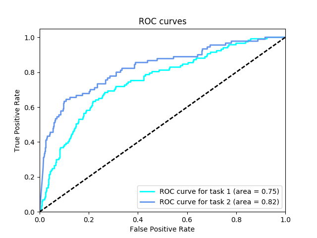
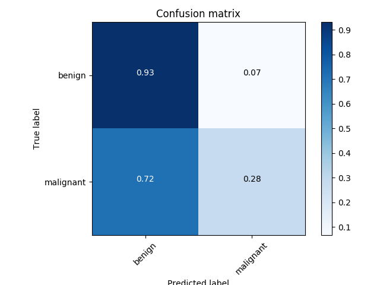

# Report 2018/01/07 (part2)
* Augumanted data (2,000 -> 10,000 images)
  * Vertical flip
  * horizontal flip
  * Random rotation x 2
* Shuffled training data
* Customized the architecture learned in [the transfer learning lession](https://github.com/udacity/deep-learning/tree/master/transfer-learning)
  * VGG19 + pretrained weights
  * Botttle neck from the relu6 layer of the VGG19
  * 2 fully connected layers on top of the bottle neck
  * dropout layers to avoid overfitting

## Output

```
Category 1 Score: 0.749
Category 2 Score: 0.824
Category 3 Score: 0.786
```




## Next

* Train with more data. (the ISIC archive data)
* More data augumentation variation
  * e.g. Random Erasing